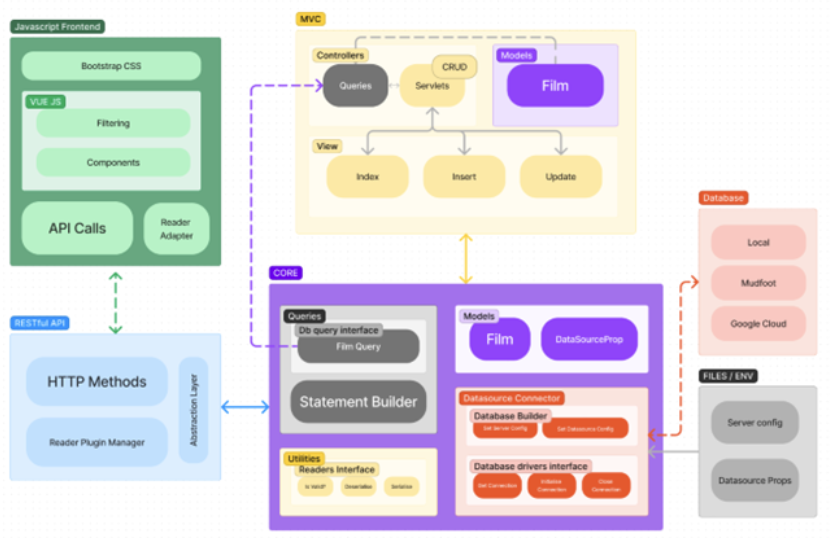

# Enterprise Project - Films Fullstack - Films Hub

Submodules can be found here:
- CRUD servlets: https://github.com/ux-zj/enterprise-servlet/tree/master
- API: https://github.com/ux-zj/enterprise-api/tree/master/src/main

## Design
Initially, I worked on this project, intending to create microservices, however, the system in its current developmental stage is more in tandem with modular architecture. Both microservices and modular architecture involve breaking down large systems into smaller components.  

One key difference is that modular architecture refers to the design of a single system where different components/modules are separated and can function independently but still be connected to the central core: 

Microservices architecture, on the other hand, refers to building a system as a "collection of small, independent services that communicate with each other through lightweight APIs".  

I think that if this project is extended further, it could satisfy the principles of microservices architecture, an API has been implemented and can be extended.

## Setting up 

This project was primarily created using IntelliJ, except for the SOAP API, which was developed using Eclipse. Ensure JDK 11 and Maven are installed and enabled. 

Each project contains a “Pom.xml” file – which is part of the Maven dependency manager. This should deal with downloading the dependencies when you first build the project. 

### Core 
This is the core module of the system that contains the business and database logic. 
Enterprise Core depends on the following: 
- XStream from Thoughtworks, 
- MYSQL Connector J, 
- Jackson Core. 
  
### Database 
Currently, databases supported are Mudfoot, Local and Google Cloud. 
The file called “ServerConfig.xml” requires the name of the database you want to connect. 
Database configuration is stored on a file called “database.json”. 
The system expects the files to be in the user’s home directory, for example: `("user.home")\zj-enterprise-config\datasources.json`. 
If none are defined or found, it will connect to Mudfoot under my credentials for this project. 
The script for the database can be found in `/setup/films.sql`. 

### MVC and Servlet 
MVC depends on:  
- Enterprise Core, 
- Jakarta Servlet-API, 
- JSTL/JSP from Glassfish 

### RESTful API 
Restful API depends on:  
- Enterprise Core, 
- Jakarta Servlet-API, 

### JS Client 
JS client is created using Vue 3 and Bootstrap 5.3. 
JS client requires the RESTful API to be running on port `8081`. 
You can change the proxy target in vue.config.js set this to whatever the API is -> target: `http://localhost:8081` 
Depending on what the API link is, you may need to change this in the same file -> pathRewrite: `{'^/FilmAPIServlet': '/enterprise_api_war_exploded/FilmAPIServlet'}`, 

## Issues/Considerations 

Upon reflection, several issues and considerations have surfaced regarding this system I’ve developed. These are: 

1. The database holds vast amount of data that needs to be accessed quickly; implementing smaller modules to deal with these large query filters, such as search, instead of it being processed in the client. 
2. The current implementation of exception handling in the code is inconsistent and lacks a clear strategy. Exceptions are being handled at different points in the code, sometimes during creation, while other times they are allowed to flow until they reach the API, resulting in confusion and difficulty in providing appropriate error messages.
3. Implementing connection pools would greatly enhance the performance of the project by enabling simultaneous access to multiple connections. 
4. The system currently lacks a mechanism for retrying failed connections. Implementing a retry logic for failed connections would greatly improve the reliability and stability of the system by ensuring that it automatically attempts to reconnect until a successful connection is established. 
5. To promote a more microservices-based architecture, I would separate the database-related functionality from the core system. This would involve moving the database-specific code into its own module, and possibly renaming the existing core module to “utilities” to better reflect its role. This separation of concerns would make the system more scalable, maintainable, and easier to deploy and test. Additionally, it would make it easier to update or replace the database functionality without affecting other parts of the system. 
6. The current system does not verify incoming requests, which could potentially leave it vulnerable to unauthorised access. To improve the security of the system, implementing a module for authenticating requests. This could be done by using techniques such as token-based authentication, API keys, or other forms of authentication and authorisation. 
7. Implementing a builder for API headers would improve the flexibility and maintainability of the system by allowing for easy modification and management of header content. This could be done by creating a separate class that is responsible for constructing and managing the headers for each API request. The builder would handle tasks such as setting the appropriate headers, adding authentication information, and handling versioning. This would make it easy to update or modify the headers without affecting the rest of the codebase and ensure that the headers are consistent across all API requests. 
8. And finally, ensure proper clean-up of resources in the system (mainly database issues) to avoid memory leaks and other performance issues. 

 
## Frameworks/Libraries Used 
- Jackson, as it provides simple abstraction methods for serialising and deserialising data to and from JSON. 
- Xstream, same as above but for XML. 
- Bootstrap, CSS library that makes prototyping easy. 
- Vue js, Framework that follows the MVC model with its primary feature being components. 
- Fast xml parser, deserialises XML but in the process of being replaced by xstream.  
